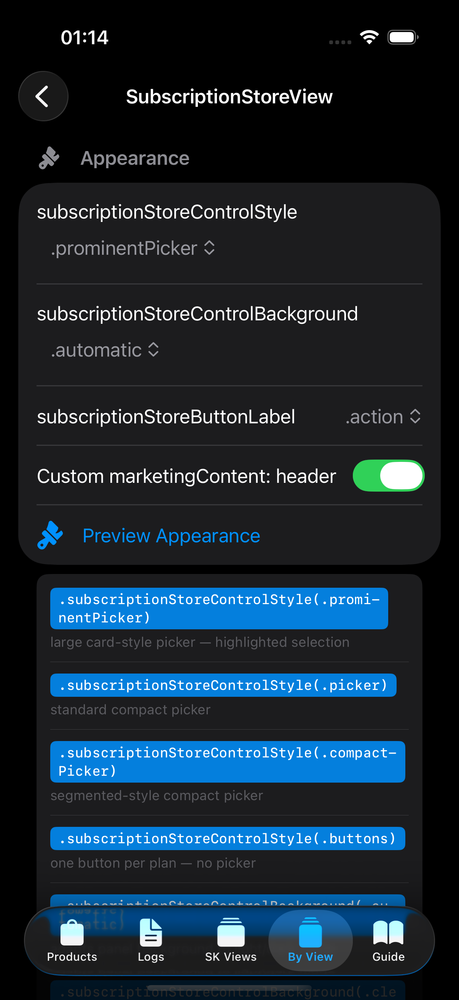
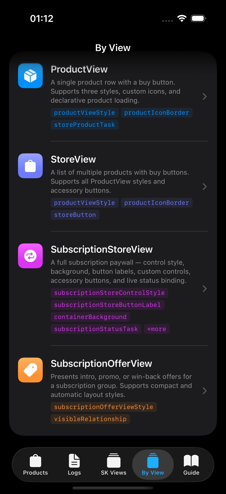
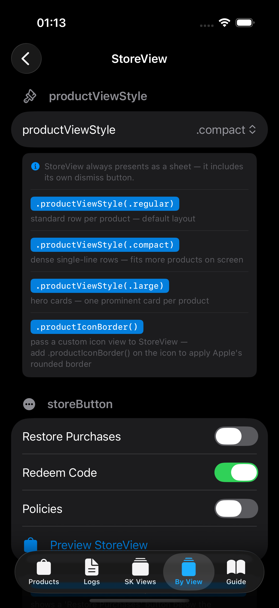
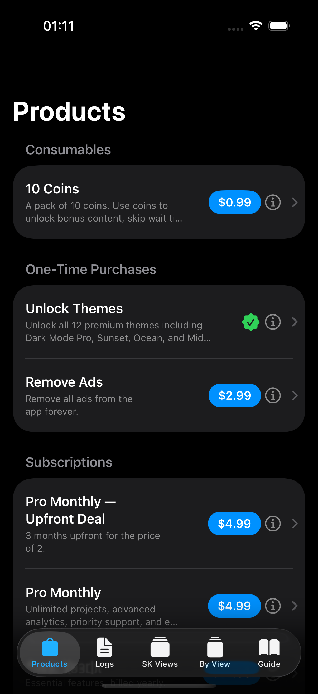
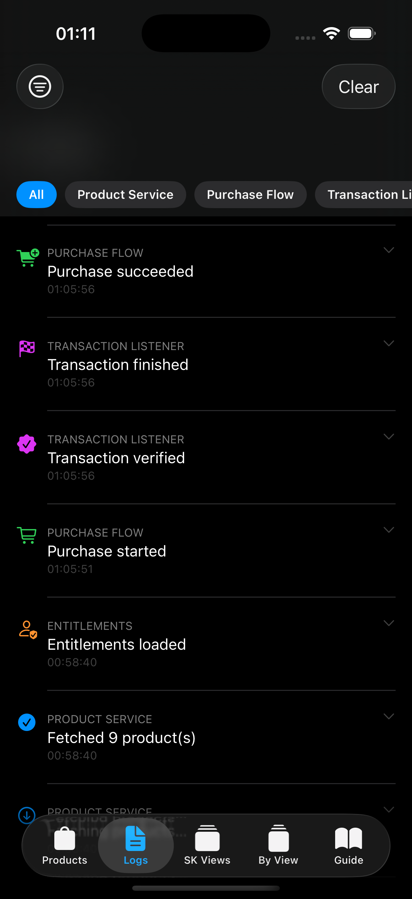
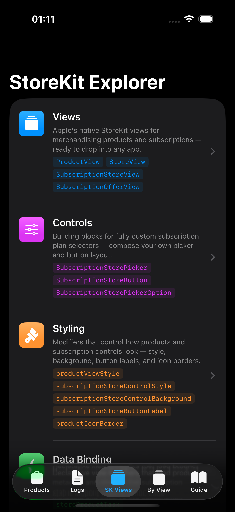

# StoreKitFlow

StoreKit 2 is powerful — but it's full of subtle production pitfalls, undocumented edge cases, and UI that takes hours to get right. StoreKitFlow gives developers and designers everything they need to ship in-app purchases with confidence.

---

## Four ways to use StoreKitFlow

### 1. Learn and explore the full StoreKit 2 API

Not sure which `SubscriptionStoreView` control style fits your design? Wondering what `containerBackground`, `subscriptionStoreButtonLabel`, or `visibleRelationships` actually do? The built-in Explorer lets you interact with every StoreKit view and modifier live — no code required.

- Browse every StoreKit view (`ProductView`, `StoreView`, `SubscriptionStoreView`, `SubscriptionOfferView`) with real purchases
- Flip between all style variants with a segmented control — without dismissing the sheet
- Toggle dark mode and Dynamic Type size to test accessibility on the spot
- Tap any modifier line to copy it directly to your clipboard

**For designers:** See exactly what each configuration looks like in real iOS UI. Switch between styles, test dark mode, and preview large text — all without asking an engineer to change the code and rebuild.

<p align="center">
  
  
  
</p>

---

### 2. Drop in your own StoreKit config and preview your products instantly

Copy your `.storekit` configuration file into the demo app and update the product IDs — that's it. Every Explorer screen, every purchase flow, and every log view will reflect your real products immediately.

No App Store Connect setup. No provisioning profiles. No sandbox accounts until you need them.

```swift
// In StoreKitFlowDemoApp.swift — replace with your own IDs
private static let configuration = StoreKitFlowConfiguration(
    productIDs: [
        "com.yourapp.premium",
        "com.yourapp.pro.monthly",
        "com.yourapp.pro.yearly"
    ],
    subscriptionGroupIDs: ["YOUR_GROUP_ID"]
)
```

**For designers:** See your actual subscription names, prices, and offer copy inside real StoreKit UI — exactly as users will see it — before a single line of production code is written.

<p align="center">
  
  
  
</p>

---

### 3. Embed the Explorer in your own app for live debugging

The Explorer isn't just for the demo app. Ship it inside your own app behind a debug flag, a shake gesture, or a settings toggle. When something goes wrong in production, you have the full picture without attaching Xcode.

```swift
// Behind a debug flag
.sheet(isPresented: $showDebugger) {
    StoreKitFlowExplorerView()
        .environmentObject(store)
}
```

The Explorer gives you:
- **Live transaction log** — every store event with category, timestamp, and full detail
- **Transaction cache** — on-device history of every verified transaction, with a delivery trail showing how many times StoreKit surfaced each one and via which code path
- **Purchase testing** — try any product with custom attributes (app account token, quantity, win-back offers, custom metadata) directly from the UI

---

### 4. Integrate StoreKitFlow as your production purchase layer

Skip the boilerplate. StoreKitFlow handles everything that's easy to get wrong:

**Typed outcomes** — one exhaustive enum instead of a mix of results, errors, and edge cases:
```swift
switch await store.purchase(product) {
case .success(let productID, _, _, _): grantAccess(productID)
case .pending:                         showPendingUI()   // Ask to Buy / billing issue
case .cancelled:                       break
case .unverified:                      break             // cryptographic check failed
case .failed(let error):               showError(error)
}
```

**Automatic missed renewal recovery** — if your app is killed mid-renewal, StoreKitFlow's reconciliation pass catches it on next launch. No code needed.

**Re-subscribe protection** — StoreKit silently returns `.success` without a payment sheet when unfinished transactions are in the queue. One parameter fixes it:
```swift
await store.purchase(product, shouldProcessUnfinishedTransactions: true)
```

**Full purchase options** — every `Product.PurchaseOption` in one struct:
```swift
PurchaseAttributes(
    appAccountToken: currentUser.uuid,
    customStringValues: ["campaign": "summer24"],
    winBackOfferID: "win_back_6month"
)
```

**On-device transaction history** — a persistent, queryable audit trail with delivery trails so you can see exactly how StoreKit handled each transaction.

---

## Quick Setup

```swift
import SwiftUI
import StoreKitFlow

@main
struct MyApp: App {
    private static let configuration = StoreKitFlowConfiguration(
        productIDs: ["com.myapp.pro.monthly", "com.myapp.coins"],
        subscriptionGroupIDs: ["YOUR_GROUP_ID"],
        appStoreID: "YOUR_APP_STORE_ID",
        enableTransactionCache: true
    )

    @StateObject private var store = StoreKitFlowStore(configuration: Self.configuration)

    var body: some Scene {
        WindowGroup {
            ContentView()
                .environmentObject(store)
                .task { await store.initialize() }
        }
    }
}
```

See [GETTING_STARTED.md](GETTING_STARTED.md) for full setup, StoreKit configuration file instructions, purchase options, testing, and protocol reference.

---

## Requirements

- iOS 17+ / macOS 14+
- Swift 5.9+
- Xcode 15+
